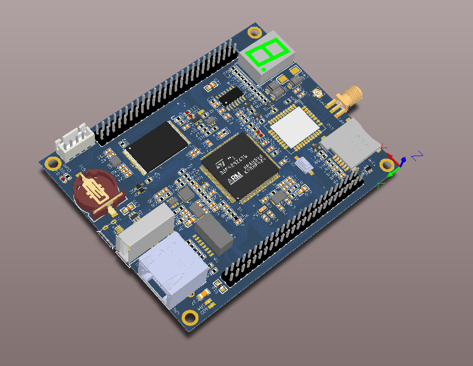

# stm32f407_gcore_rtt_prj 开发板 BSP 说明

## 简介

本文档基于 RT-Thread ，为 stm32f407_gcore_rtt_prj 核心板提供的 BSP (板级支持包) 说明。

主要内容如下：

- 核心资源介绍
- BSP 快速上手
- 进阶使用方法


## 开发板介绍

开发板外观如下图所示：



该开发板常用 **板载资源** 如下：

- MCU：STM32F407VGT6，主频 168MHz，1024KB FLASH ，192KB RAM
- 常用外设
  - LED：3个用户 LEDs
  - 按键，1个，Reset
- 调试接口
  - 使用SWD调试模式。	


## 外设支持

本 BSP 目前对外设的支持情况如下：

| **片上外设** | **支持情况** |               **备注**                |
| :------------ | :----------: | :-----------------------------------: |
| GPIO         |     支持     | PA0, PA1... PH1 ---> PIN: 0, 1...144 |
| UART         |     支持     |              UART1              |
| SPI          |     支持     |               SPI1               |
| I2C          |     支持     |               软件 I2C                |
| USB          |     支持     |   虚拟串口、USB-DEVICE、USB-HOST      |
| FSMC         |     支持     |             NandFlash                 |


## 使用说明


### 快速上手

本 BSP 为开发者提供 MDK4、MDK5 和 IAR 工程，并且支持 GCC 开发环境。下面以 MDK5 开发环境为例，介绍如何将系统运行起来。

#### 硬件连接

使用数据线连接开发板到 PC，打开电源开关。

#### 编译下载

双击 project.uvprojx 文件，打开 MDK5 工程，编译并下载程序到开发板。

> 工程默认配置使用 ST-LINK 下载程序，在通过ST-LINK 连接开发板的基础上，点击下载按钮即可下载程序到开发板

#### 运行结果

下载程序成功之后，系统会自动运行，观察开发板上 LED 的运行效果，红色 LD1 和 LD2 常亮，红色 LD5 会周期性闪烁。

连接开发板对应串口到 PC , 在终端工具里打开相应的串口（115200-8-1-N），复位设备后，可以看到 RT-Thread 的输出信息:

```c
 \ | /
- RT -     Thread Operating System
 / | \     3.1.1 build Nov 19 2018
 2006 - 2018 Copyright by rt-thread team
msh >
```
### 进阶使用

此 BSP 默认只开启了 GPIO 和 串口1 的功能，更多高级功能，需要利用 ENV 工具对 BSP 进行配置，步骤如下：

1. 在 bsp 下打开 env 工具。

2. 输入`menuconfig`命令配置工程，配置好之后保存退出。

3. 输入`pkgs --update`命令更新软件包。

4. 输入`scons --target=mdk4/mdk5/iar` 命令重新生成工程。


## 注意事项

暂无

## 联系人信息

维护人:

